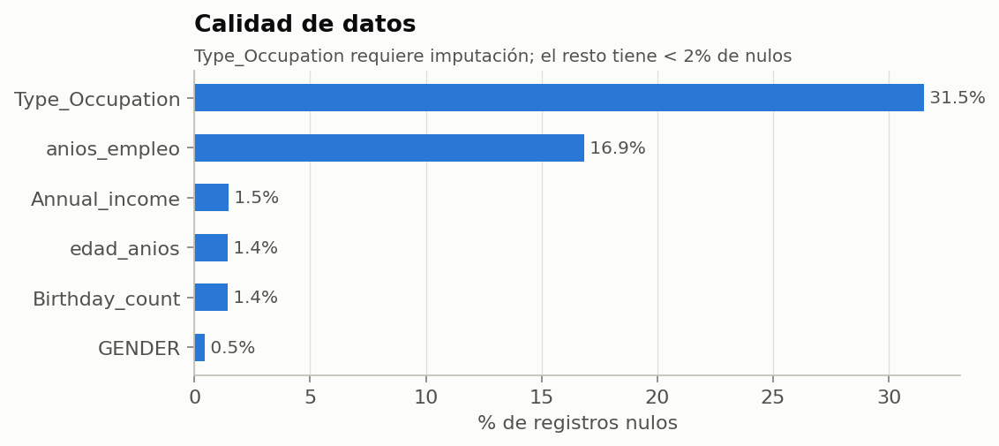
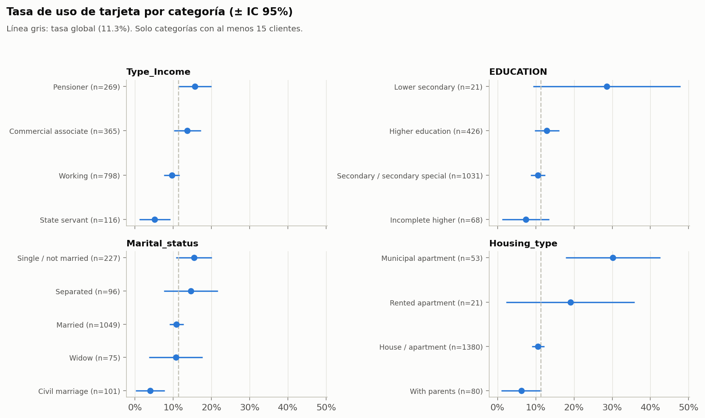
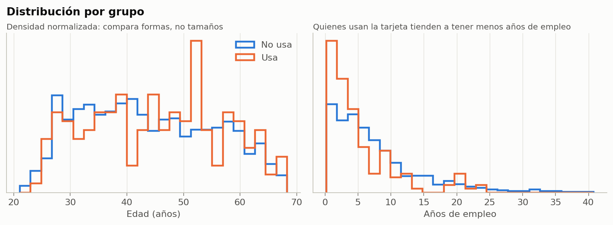
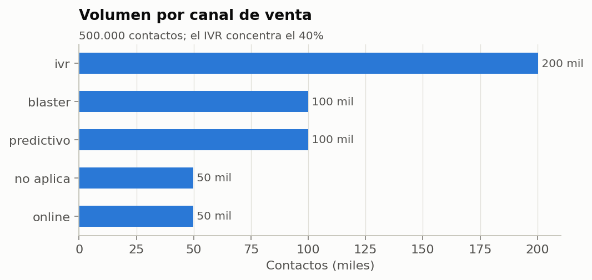
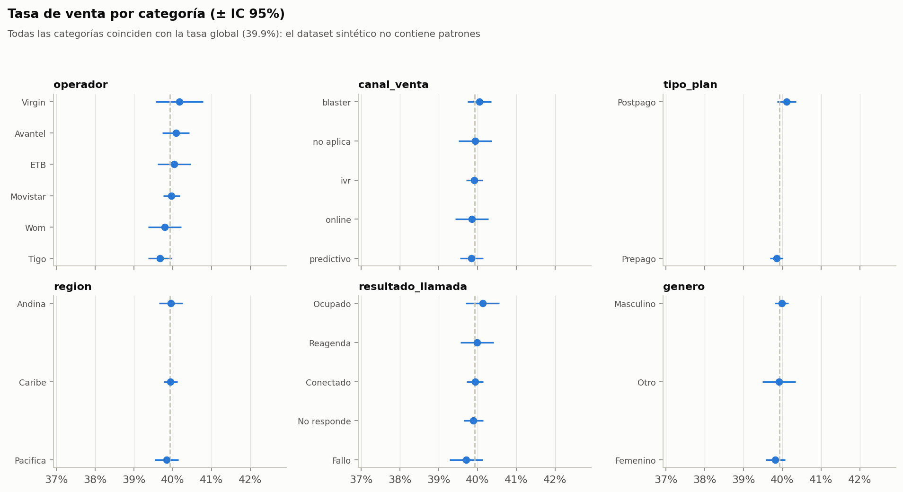

<div align="center">

# Data Analytics · Exploratory Data Analysis

[Español](README.md) · **English**

Exploratory analyses (EDA) that turn raw data into model-ready datasets: data quality,
imputation, outliers, noise reduction, and statistical validation of every feature.


</div>

## Overview

| Project | Data | What was done | Outcome |
|---------|------|---------------|---------|
| [Credit card usage](#1-credit-card-usage) | 1,548 customers, 18 features, 11% positives | Coefficient-of-variation imputation, IQR outliers, noise binning, Pearson, Spearman, and Chi² | Dataset for the [classification model](https://github.com/RonaldBarberi/data_science/blob/main/README.en.md#1-credit-card-usage-propensity) (ROC-AUC 0.74 CV) |
| [BPO sales](#2-bpo-telemarketing-sales) | 500,000 synthetic contacts, 23 features | Memory-efficient dtypes, cardinality control, interaction grouping, ordinal encoding | Dataset for the [propensity model](https://github.com/RonaldBarberi/data_science/blob/main/README.en.md#4-sales-propensity-signal-validation); confirmed there is no signal |

> Notebooks and chart labels are in Spanish; this page summarizes them in English.

---

## 1. Credit card usage

[`projects/eda_clientes_uso_tarjeta`](projects/eda_clientes_uso_tarjeta) ·
[Notebook](projects/eda_clientes_uso_tarjeta/src/eda_xbt_clientes_uso_tarjeta.ipynb) ·
[](https://colab.research.google.com/github/RonaldBarberi/data_analytics/blob/main/projects/eda_clientes_uso_tarjeta/src/eda_xbt_clientes_uso_tarjeta.ipynb)

**Process**
1. Join customers and labels, with column dtypes set to reduce memory.
2. Missing values: features with a coefficient of variation above 30% are imputed with the median; the rest with the mean.
3. IQR outlier treatment. Filters apply only to the majority class so no positives are lost.
4. Percentile binning for noisy features.
5. Encoding and feature relevance with Pearson, Spearman, and Chi².

**Findings**
- `Type_Occupation` is **31.5% missing**; every other feature is below 2%.
- Pensioners use the card more than average (15.6% vs. 11.3%), while state servants use it less (5.2%).
- Customers living in municipal apartments have a 30.2% rate, three times that of homeowners (10.6%), although they are only 53 customers.

<p align="center">
  
  
  
</p>

## 2. BPO telemarketing sales

[`projects/eda_reg_clientes_venta_bpo`](projects/eda_reg_clientes_venta_bpo) ·
[Notebook](projects/eda_reg_clientes_venta_bpo/src/eda_validator_data.ipynb)

**Context.** 500,000 contacts from a simulated campaign (carrier, channel, plan, region, call outcome…). The data was **randomly generated** to practice the full workflow at a realistic volume.

**Process**
- `category` and `int8`/`int16` dtypes to reduce memory.
- Removal of identifiers and dates with no predictive value.
- Cardinality control and grouping of calls (predictive, blaster, IVR, SMS) into a single interactions feature.
- Ordinal encoding and Pearson correlation with the target.

**Conclusion.** Every category has the same sales rate (39.9%) within its confidence interval. That is the expected behavior of random data, and the [modeling notebook](https://github.com/RonaldBarberi/data_science/blob/main/README.en.md#4-sales-propensity-signal-validation) confirms it with AUC 0.50.

<p align="center">
  
  
</p>

---

## Reusable utilities

| File | Contents |
|------|----------|
| [`utils/cls_statistics_dt_scientist_rebr.py`](utils/cls_statistics_dt_scientist_rebr.py) | EDA helpers in **pandas and PySpark**: class imbalance, missing-value heatmap, coefficient-of-variation imputation, outliers, percentile noise binning, and correlation/relevance (Pearson, Spearman, Chi²). |
| [`utils/cls_dt_engeerin.py`](utils/cls_dt_engeerin.py) | Spark configuration and session, pandas-to-PySpark conversion, and SQL over RDDs. |
| [`utils/plot_style.py`](utils/plot_style.py) | Shared chart style (colorblind-safe palette). |

## How to run

```bash
git clone https://github.com/RonaldBarberi/data_analytics.git
cd data_analytics/projects/eda_clientes_uso_tarjeta
pip install -r config/requirimients.txt
jupyter notebook src/eda_xbt_clientes_uso_tarjeta.ipynb
python src/make_report_figures.py      # regenerates the README figures
```

---

<p align="center">
  <b>Ronald Barberi</b> · Data Scientist & Data Engineer ·
  <a href="https://www.linkedin.com/in/ronald-eduardo-barberi-ria%C3%B1o-rebr/">LinkedIn</a> ·
  <a href="https://github.com/RonaldBarberi">GitHub</a>
</p>
